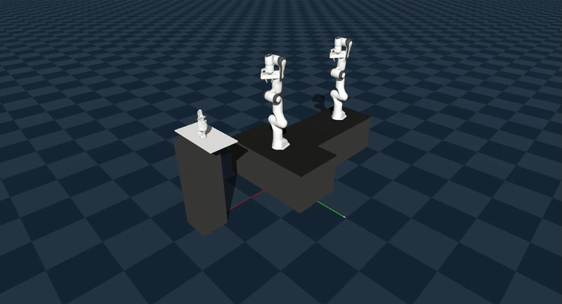

# Genesis: Robotic Transportation simulation test

In the project repository:
> git clone https://github.com/Genesis-Embodied-AI/Genesis

Genesis is a research-driven project focused on robotic object reconstruction using dexterous manipulation. The system employs dual robotic arms to analyze, grasp, and reconstruct objects in a structured environment. This project explores motion planning techniques to enable intelligent robotic interactions between the involved subjects.

The GIF above showcases a simulation of real-time object reconstruction using dual robotic arms in a simulation environment (the second robotic arm is supposed to have a mounted camera).
